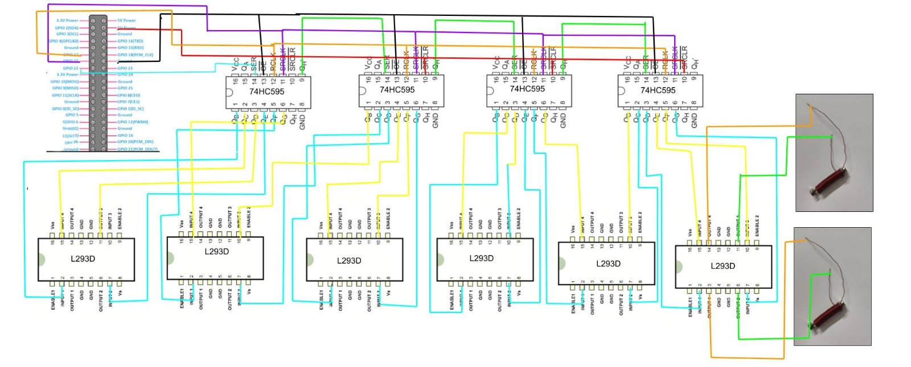

# Refreshable Braille Display

## Table of Contents
- [Introduction](#introduction)
- [Overview](#overview)
- [Components Required](#components-required)
- [Software Setup](#software-setup)
- [Table for Pin Connections](#table-for-pin-connections)
- [Pinout Diagram](#pinout-diagram)
- [Working Code](#working-code)
- [Demo Video](#demo-video)
- [Usage](#usage)
- [Acknowledgements](#acknowledgements)

## Introduction
This project aims to develop a refreshable braille display to assist visually impaired individuals. The display will convert digital/printed text into braille in real-time, enabling users to read digital/printed content through the braille display.

## Overview
The system captures images using the camera module and processes them through Tesseract OCR to extract textual content. The extracted text is then mapped to corresponding braille characters using a predefined dictionary. Each braille character's representation is translated into signals to control the position of braille dots via GPIO pins on the Raspberry Pi. The mechanical braille dot mechanism, driven by current flow through a copper wire wound around a plastic pipe with a nail and magnets, moves the dots up or down to form the braille characters. This process ensures that users can read text accurately and efficiently in braille format.

### Key Features
1. **Camera Integration:** Incorporate a Raspberry Pi-compatible camera module to capture images of text.
2. **OCR Processing:** Use Tesseract OCR to extract text from captured images.
3. **Braille Output:** Display the converted text as braille characters on a refreshable braille display in real time.
4. **Mechanical Braille Dots:** Implement braille dots using copper wire wound around a plastic pipe with a nail inside, attached to magnets. The dots move up and down based on the current flow, providing feedback for braille characters.
5. **Software Interface:** Develop a user-friendly software interface to control the device.


## Components Required
| **Component**       | **Description**                     |
|---------------------|-------------------------------------|
| **IC Chips**        | 74HC595 (Shift Register) x4 <br> L293D (H-Bridge) x6           |
| **Microcontroller** | Raspberry Pi Zero 2W                 |
| **Camera Module**| Raspberry Pi camera module|
| **SD card**|Storage for Raspberry Pi 32GB|
| **Power Supply**    | Rechargebale Batteries (3.2V, 6000mah 3C ) x2                   |
| **Other Components**| Insulated Copper Wire (50m) <br> Iron Nails x12 <br> Magnets x24 <br> Hookup Wires <br> Perf Board <br> Push Buttons x3|


## Software Setup
1. **Install Raspbian OS**: Follow the official Raspberry Pi documentation to install Raspbian OS on the Raspberry Pi Zero 2W.
2. **Enable Camera**: Use `raspi-config` to enable the camera module. 
3. **Install Required Libraries**:
   ```bash
   sudo apt-get update
   sudo apt-get install python3-rpi.gpio python3-picamera
   sudo pip3 install rpicam2 pytesseract gpiozero pillow
   ```
4. Clone the Project Repository
   ```bash
   git clone https://github.com/LokeshAravapalli/refreshable-braille-display.git
   cd refreshable-braille-display
   ```

# Table for Pin Connections

#(Note: VCC, GND, Enable Pins are not mentioned since they are the same for all components.)

| **Component**          | **Pin Name**         | **Connected to** | **Description**        |
|------------------------|----------------------|----------------------|------------------------|
| Camera Module          | CSI Interface        | CSI Interface        | Camera connection      |
| 74HC595 Shift Register | SER (Serial Data)    | GPIO 17              | Serial Data            |
|                        | SRCLK (Shift Clock)  | GPIO 27              | Shift Clock            |
|                        | RCLK (Latch Clock)   | GPIO 22              | Latch Clock            |
|                        | Output Bits   | Inputs of H-Bridges         | Input to control the H-Bridge           |

The shift registers will maintain the state of the braille dot. 2-bits from the shift register are given as input to the H-Bridge to control the H-Bridge.

| **Component**          | **Pin Name**         | **Connected to** | **Description**        |
|------------------------|----------------------|----------------------|------------------------|
| L293D H-Bridge         | IN1                  |One of the output bits of the shift register             | Input to control the current direction|
|                        | IN2                  |One of the output bits of the shift register             | Input to control the current direction|
|                        | IN3                  |One of the output bits of the shift register             | Input to control the current direction|
|                        | IN4                  |One of the output bits of the shift register             | Input to control the current direction|
||OUT1 && OUT2|2 terminals of an electromagnet|current direction controls the state of braille dot (up/down)|
||OUT3 && OUT4|2 terminals of an electromagnet|current direction controls the state of braille dot (up/down)|
||VSS2|Battery positive terminal|To provide current to the electromagnets|

Each H bridge can control 2 electromagnets (braille dot) at a time. The shift registers maintain the state of the braille dot.

| **Component**          | **Pin Name**         | **Connected to** | **Description**        |
|------------------------|----------------------|----------------------|------------------------|
| Push Buttons           | Button 1             | GPIO 26 & other terminal to ground             | User input button 1    |
|                        | Button 2             | GPIO 19 & other terminal to ground             | User input button 2    |
|                        | Button 3             | GPIO 23 & other terminal to ground             | User input button 3    |


## Pinout Diagram

Note: VCC, GND, and Enable Pin (connected Vcc) are not drawn in the above picture for clarity.

### Circuit and Code Explanation
When the push button is pressed, the camera captures the image and detects the text in it using the Pytesseract library.
After text detection, we send output to shift registers in such a way their bits corresponds to each braille dot.
We need 2 bits to control the direction of the current in H-Bridge. By giving using the shift register we maintain the state of bits and also control the current direction in the H-Bridge.
Depending upon the direction of the current the dot either moves forward or backwards.

We have used 3 push buttons as input.
1 - To capture the image.
2 - To move to the next character.
3 - To move to the previous character.

## Working Code
```python
from picamera2 import Picamera2
from PIL import Image
import pytesseract
from gpiozero import LED, Button
import time

text = ""
letter1 = 0
letter2 = 1
num_of_characters = 2
camera = Picamera2()

def capture():
    global text
    config = camera.create_still_configuration()
    camera.configure(config)

    camera.start()
    camera.capture_file('image.jpg')
    camera.stop()
    print("Image Saved")
    text = pytesseract.image_to_string(Image.open('image.jpg'))
    print(text)


# Define GPIO pins
latchPin = 17
clockPin = 27
dataPin = 22

# Define input pins for buttons
button1Pin = 26
button2Pin = 19
button3Pin = 23

# Braille dictionary
brailleDictionary = {
    'A': 0b000001,
    'B': 0b000011,
    'C': 0b001001,
    'D': 0b011001,
    'E': 0b010001,
    'F': 0b001011,
    'G': 0b011011,
    'H': 0b010011,
    'I': 0b001010,
    'J': 0b011010,
    'K': 0b000101,
    'L': 0b000111,
    'M': 0b001101,
    'N': 0b011101,
    'O': 0b010101,
    'P': 0b001111,
    'Q': 0b011111,
    'R': 0b010111,
    'S': 0b001110,
    'T': 0b011110,
    'U': 0b100101,
    'V': 0b100111,
    'W': 0b111010,
    'X': 0b101101,
    'Y': 0b111101,
    'Z': 0b110101
}

# Initialize shift register data
d1 = 0
d2 = 0
d3 = 0
d4 = 0

# Initialize LEDs and buttons
latch = LED(latchPin)
clock = LED(clockPin)
data = LED(dataPin)
button1 = Button(button1Pin, pull_up=True)
button2 = Button(button2Pin, pull_up=True)
button3 = Button(button3Pin, pull_up=True)

def updateShiftRegisters():
    latch.off()
    shiftOut(data, clock, d4)
    shiftOut(data, clock, d3)
    shiftOut(data, clock, d2)
    shiftOut(data, clock, d1)
    latch.on()

def shiftOut(data, clock, val):
    for i in range(8):
        clock.off()
        data.value = (val & (1 << (7 - i))) != 0
        clock.on()

def getBraillePattern(letter):
    return brailleDictionary.get(letter.upper(), 0)

def createByte(b7, b6, b5, b4, b3, b2, b1, b0):
    return ((1 if b7 else 0) << 7) | ((1 if b6 else 0) << 6) | ((1 if b5 else 0) << 5) | ((1 if b4 else 0) << 4) | ((1 if b3 else 0) << 3) | ((1 if b2 else 0) << 2) | ((1 if b1 else 0) << 1) | (1 if b0 else 0)


def displayBraille(text):
    global d1, d2, d3, d4
    braillePattern1 = getBraillePattern(text[0])
    braillePattern2 = getBraillePattern(text[1])

    d1 = createByte(
        0,
        braillePattern1 & 0b010000,
        braillePattern1 & 0b000010,
        not (braillePattern1 & 0b000001),
        not (braillePattern1 & 0b001000),
        braillePattern1 & 0b001000,
        braillePattern1 & 0b000001,
        0
    )

    d2 = createByte(
        0,
        not (braillePattern1 & 0b000100),
        not (braillePattern1 & 0b100000),
        braillePattern1 & 0b100000,
        braillePattern1 & 0b000100,
        not (braillePattern1 & 0b000010),
        not (braillePattern1 & 0b010000),
        0
    )

    d3 = createByte(
        0,
        braillePattern2 & 0b010000,
        braillePattern2 & 0b000010,
        not (braillePattern2 & 0b000001),
        not (braillePattern2 & 0b001000),
        braillePattern2 & 0b001000,
        braillePattern2 & 0b000001,
        0
    )

    d4 = createByte(
        0,
        not (braillePattern2 & 0b000100),
        not (braillePattern2 & 0b100000),
        braillePattern2 & 0b100000,
        braillePattern2 & 0b000100,
        not (braillePattern2 & 0b000010),
        not (braillePattern2 & 0b010000),
        0
    )
    print(braillePattern2&0b100000)
    print(f'd1: {d1:08b}, d2: {d2:08b}, d3: {d3:08b}, d4: {d4:08b}')
    updateShiftRegisters()

def main():
    ## displayBraille("AA")
    global letter1, letter2, text, num_of_characters
    try:
        while True:
            #text = input()
            if button1.is_pressed:
                print("Button 1 pressed. Capturing Image")
                capture()
                letter1 = 0
                letter2 = 1
                displayBraille(text[letter1]+text[letter2])
            elif button2.is_pressed:
                print("Button 2 pressed. Displaying next letters")
                letter1 = letter1+num_of_characters
                letter2=letter2+num_of_characters
                displayBraille(text[letter1]+text[letter2])
            elif button3.is_pressed:
                print("Button 3 pressed. Displaying the previous letters")
                letter1 = letter1-num_of_characters
                letter2=letter2-num_of_characters
                displayBraille(text[letter1]+text[letter2])
            time.sleep(0.1)  # Check button state every 0.1 second
    except KeyboardInterrupt:
        pass

main()
```

## Demo Video
https://github.com/LokeshAravapalli/refreshable-braille-display/tree/main/demo

## Usage
1. After setting up the software and hardware, run the above code under - [Working Code](#working-code)
2. Place the printed/ electronic text in front of the camera and press the button 1 to capture it. As soon as you press the first few letters of the text are displayed in braille.
3. Press button 2 to display the next characters in the text and button 3 to go back in the text.

## Acknowledgements
### Contributors
Thanks to the following people who have contributed to this project:
- **[Lokesh]** - [[GitHub Profile Link](https://github.com/LokeshAravapalli)]
- **[Sujit]** - [[GitHub Profile Link](https://github.com/GSujit)]
- **[Lohitaksh]** - [[GitHub Profile Link](https://github.com/LohitakshMaruvada)]
  
### Contact
Any queries, please contact us at [Lokeshkumar.Aravapalli@iiitb.ac.in] / [Sujit.Ghantasala@iiitb.ac.in] /[Lohitaksh.Maruvada@iiitb.ac.in].
